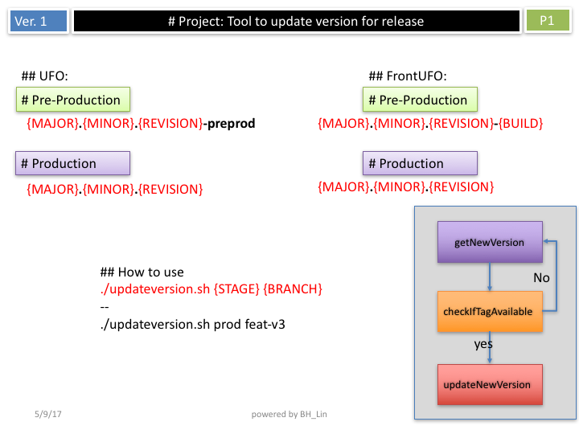

# Version Update Tool for Release

A shell script tool that automatically updates version numbers for releases in Travis CI pipelines. This tool handles version incrementing, tagging, and deployment environment configuration for both pre-production and production releases.

## Overview



## Features

- **Automatic Version Incrementing**: Reads current version from `.travis.yml` and increments the revision number
- **Multi-Environment Support**: Handles both pre-production and production deployments
- **Branch-Specific Deployment**: Supports `ufo-v3` and `feat-v3` branches with different deployment configurations
- **Git Integration**: Automatically commits changes, creates tags, and pushes to remote repository
- **Tag Validation**: Checks if a tag already exists before creating a new one

## Prerequisites

- Git repository with `.travis.yml` file containing `DEPLOY_TAG` configuration
- Access to push to the target repository
- Bash shell environment

## Usage

```bash
./updateversion.sh <stage> <branch>
```

### Parameters

- **stage**: Target deployment stage
  - `pp` - Pre-production
  - `prod` - Production

- **branch**: Target git branch
  - `ufo-v3` - UFO version 3 branch
  - `feat-v3` - Feature version 3 branch

### Examples

Deploy to pre-production on ufo-v3 branch:
```bash
./updateversion.sh pp ufo-v3
```

Deploy to production on feat-v3 branch:
```bash
./updateversion.sh prod feat-v3
```

## How It Works

1. **Branch Checkout**: Switches to the specified target branch and pulls latest changes
2. **Version Extraction**: Reads the current version from `DEPLOY_TAG` in `.travis.yml`
3. **Version Increment**: Increments the revision number (patch version)
4. **Environment Suffix**: Adds appropriate suffix based on stage and branch:
   - `ufo-v3` + `pp` → `-preprod` suffix
   - `feat-v3` + `pp` → `-1` suffix
   - `prod` → no suffix
5. **File Update**: Updates `.travis.yml` with the new version
6. **Git Operations**: Commits changes, creates a tag, and pushes to remote
7. **Tag Validation**: Ensures the new tag doesn't already exist before proceeding

## Version Format

The tool follows semantic versioning with environment-specific suffixes:
- Production: `major.minor.patch` (e.g., `1.2.3`)
- Pre-production (ufo-v3): `major.minor.patch-preprod` (e.g., `1.2.3-preprod`)
- Pre-production (feat-v3): `major.minor.patch-1` (e.g., `1.2.3-1`)

## Error Handling

- Validates that exactly 2 arguments are provided
- Checks for valid stage and branch combinations
- Verifies tag availability before creating new releases
- Continues incrementing version numbers until an available tag is found